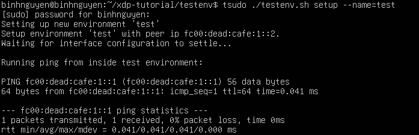
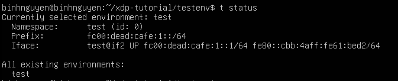
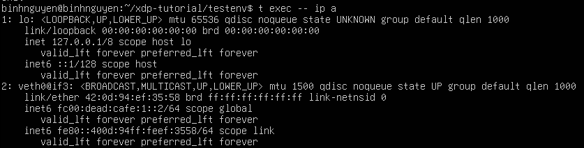
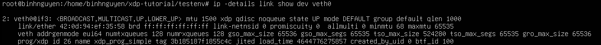
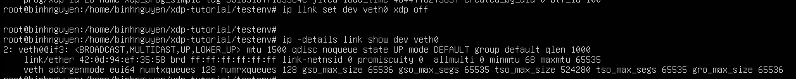

# TẢI CHƯƠNG TRÌNH BPF VÀO HOOK TRÊN MỘT CỔNG MẠNG
# 1. Setup dependencies
- Dùng lệnh sau để clone toàn bộ repo kèm theo các submodule:
```
git clone --recurse-submodules https://github.com/xdp-project/xdp-tutorial.git
```
- Để biên dịch được mã nguồn (vì đây là dự án liên quan đến eBPF/XDP), cài thêm các thư viện sau:
```
sudo apt install build-essential clang llvm libelf-dev libbpf-dev iproute2
```

# 2. Compiling example code
- 
```
cd ~/xdp-tutorial/basic01-xdp-pass
```
- Gõ lệnh `make` 

# 3. Sử dụng script testenv.sh để tạo môi trường test ảo cho XDP
- Chuyển tới thư mục chứa script:
```
cd ~/xdp-tutorial/testenv
```
- Chạy lệnh:
```
./testenv.sh setup --name=test
```


- Tạo alias để dùng dễ hơn:
```
eval $(./testenv.sh alias)
```
- Sau khi chạy lệnh alias thành công có thể dùng các lệnh ngắn sau trong namespace:
   - `t status`: Xem môi trường đang hoạt động
   

   - `t enter`: Vào bên trong namespace test
   - `t exec -- ip a`: Show ip của namespace
   

   - `t teardown`: Gỡ môi trường test
# 4. Loading and the XDP hook
- BPF-byte-code sẽ được lưu trữ trong một ELF file, để tải file này vào trong kernel người dùng cần công cụ ELF loader để đọc file và chuyển nó đến kernel đúng định dạng.

- Thư viện `libbpf` cung cấp cả ELF loader và một số BPF-helper-functions.
- Thư viện `libxdp` cung cấp các helper functions để tải và cài đặt các chương trình XDP bằng cách sử dụng giao thức XDP multi-dispatch, cũng như các hàm trợ giúp để sử dụng socket AF_XDP. Thư viện libxdp sử dụng libbpf và bổ sung thêm một số tính năng mở rộng.

- Trong bài này, mã C trong xdp_pass_user.c (được biên dịch thành chương trình xdp_pass_user) minh họa cách viết một trình tải BPF dành riêng cho file ELF xdp_pass_kern.o. Trình tải này sẽ gắn chương trình trong file ELF vào hook XDP trên một thiết bị mạng.

- Có một số cách khác để tải chương trình vào kernel:
   - Công cụ iproute2 tiêu chuẩn.
   - xdp-loader từ bộ công cụ xdp-tools.
## 4.1 Loading via iproute2 ip
- Gõ lệnh `t enter` để truy cập namespace.
- Gắn chương trình file ELF vào hook bằng lệnh:
```
ip link set dev veth0 xdp obj /home/binhnguyen/xdp-tutorial/basic01-xdp-pass/xdp_pass_kern.o sec xdp
```
- Gõ lệnh sau để xem chương trình đã được gắn thành công hay chưa:
```
ip -details link show dev veth0
```
- Nếu XDP đã được gắn, sẽ xuất hiện dòng:
```
prog/xdp id 408 name xdp_prog_simple tag 3b185187f1855c4c jited
```



- Gõ lệnh dưới để gỡ chương trình XDP khỏi interface:

```
ip link set dev veth0 xdp off
```

## 4.2 Loading using xdp-loader
## 4.3 Loading using xdp_pass_user
