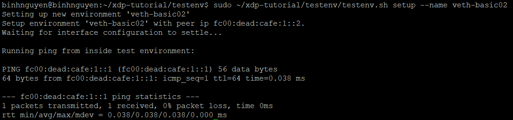
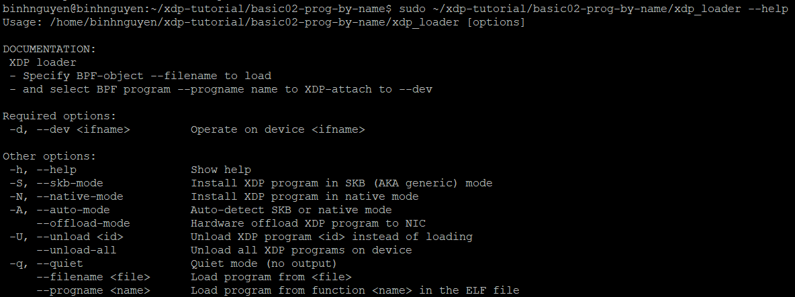
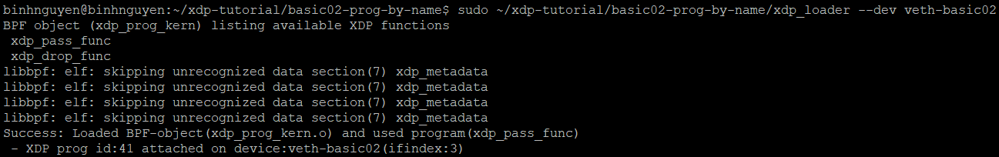
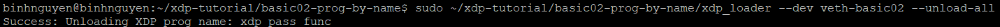
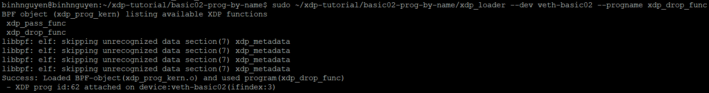
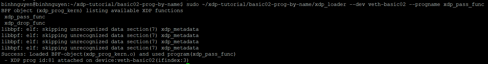
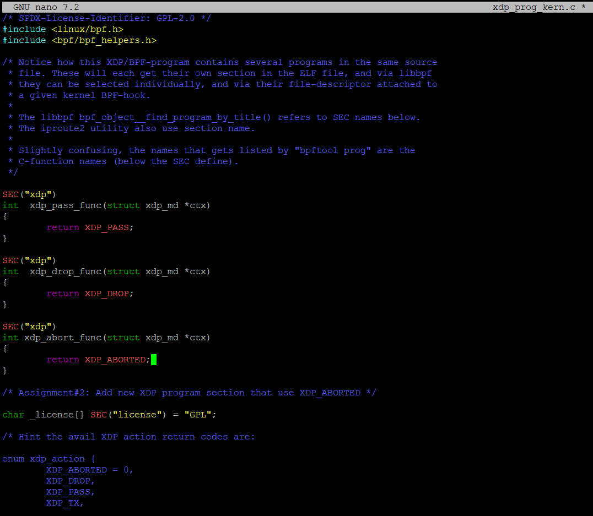
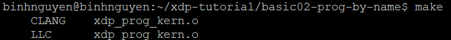
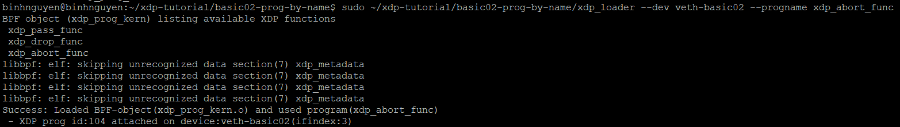
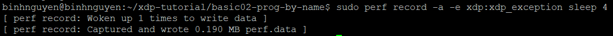

# LOADING A PROGRAM BY NAME
# 1. ASSIGNMENT 
## 1.1 **Assignment 1: Setting up your test lab**
- Khởi tạo môi trường test bằng câu lệnh:
```
sudo ~/xdp-tutorial/testenv/testenv.sh setup --name veth-basic02
```



- Kiểm tra các tùy chọn có sẵn có thể sử dụng với `xdp_loader` bằng cách dùng tùy chọn `--help`:

```
sudo ~/xdp-tutorial/basic02-prog-by-name/xdp_loader --help
```



- Một số command để thực hiện với xdp_loader:

Tải chương trình XDP mặc định từ file `xdp_prog_kern.o` vào thiết bị mạng veth-basic02
```
sudo ~/xdp-tutorial/basic02-prog-by-name/xdp_loader --dev veth-basic02
```



Gỡ bỏ toàn bộ chương trình XDP hiện đang được gắn vào thiết bị veth-basic02.
```
sudo ~/xdp-tutorial/basic02-prog-by-name/xdp_loader --dev veth-basic02 --unload-all
```



Tải chương trình có tên `xdp_drop_func` từ file .o vào thiết bị veth-basic02.
```
sudo ~/xdp-tutorial/basic02-prog-by-name/xdp_loader --dev veth-basic02 --progname xdp_drop_func
```



Tải chương trình `xdp_pass_func` vào thiết bị veth-basic02.
```
sudo ~/xdp-tutorial/basic02-prog-by-name/xdp_loader --dev veth-basic02 --progname xdp_pass_func
```


## 1.2 **Assignment 2: Add xdp_abort program**
- Thêm hàm `xdp_abort_func` vào file `xdp_prog_kern.c`:



- Chạy lệnh `make` để biên dịch lại chương trình `xdp_prog_kern.o`:


- Tải chương trình `xdp_abort_func` vào thiết bị veth-basic02:

```
sudo ~/xdp-tutorial/basic02-prog-by-name/xdp_loader --dev veth-basic02 --progname xdp_abort_func
```



- `XDP_ABORTED` khác với `XDP_DROP`, vì nó kích hoạt một tracepoint có tên là `xdp:xdp_exception`.

- Khi thực hiện ping từ trong namespace, hãy ghi lại tracepoint này và quan sát các bản ghi (record):

```
sudo perf record -a -e xdp:xdp_exception sleep 4
```

