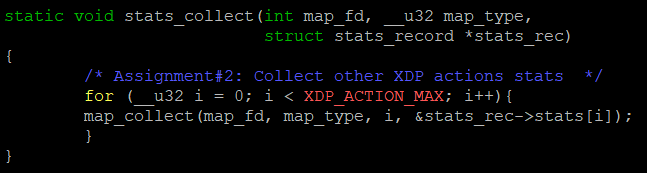

# COUNTING WITH BPF MAPS
Tìm hiểu về BPF maps, cơ chế lưu trữ dữ liệu bền vững (persistent) dành cho các chương trình BPF. 

Hai loại BPF MAP được tìm hiểu ở đây là:
- BPF_MAP_TYPE_ARRAY 
- BPF_MAP_TYPE_PERCPU_ARRAY
 
# 1. Things you will learn in this lesson
## 1.1 **Defining a map**

- Việc tạo một BPF map được thực hiện bằng cách khai báo một struct toàn cục (trong file xdp_prog_kern.c) với phần đánh dấu đặc biệt là SEC(".maps"), như ví dụ dưới đây:

```
struct {
	__uint(type, BPF_MAP_TYPE_ARRAY);
	__type(key, __u32);
	__type(value, struct datarec);
	__uint(max_entries, XDP_ACTION_MAX);
} xdp_stats_map SEC(".maps");
```
 
 - BPF maps là nơi lưu trữ dữ liệu kiểu key/value (khóa/giá trị).
 - Mỗi map có một kiểu nhất định (type) và số phần tử tối đa (max_entries).
 - Ở đây, ta dùng loại đơn giản là BPF_MAP_TYPE_ARRAY, nghĩa là map này là một mảng, với số phần tử được cấp phát ngay khi tạo.
 - Map cho phép chương trình BPF lưu trữ trạng thái hoặc thống kê, như: đếm số gói tin bị drop, pass, lỗi,...Dữ liệu trong map có thể được truy cập từ cả kernel space (chương trình BPF) lẫn user space (chương trình C/Python ngoài kernel).

## 1.2 libbpf map ELF relocation

## 1.3 bpf_object to bpf_map
## 1.4 Reading map values from user space
# 2. Assignment
## 2.1 Assignment 1: Add bytes counter
`struct datarec` là một cấu trúc dữ liệu (data structure) được dùng để lưu trữ thống kê (statistics) về các gói tin mà chương trình XDP xử lý.

`struct datarec` được sử dụng trong file `common_kern_user.h`.

Mở file `common_kern_user.h`,  thêm một trường mới để đếm số byte:
```
struct datarec {
    __u64 rx_packets;
    __u64 rx_bytes;  // biến môi trường để số bytes 
};
```
### 2.1.1 Assignment 1.1: Update the BPF program
`struct xdp_md` là cấu trúc dữ liệu mà kernel truyền vào cho chương trình eBPF khi có gói tin đến. Nó chứa thông tin mô tả về gói tin như vị trí dữ liệu, kích thước gói, chỉ số interface, v.v...
```
struct xdp_md {
    __u32 data;             // con trỏ tới vị trí đầu gói tin (start of packet data)
    __u32 data_end;         // con trỏ tới vị trí kết thúc gói tin (end of packet data)
    __u32 data_meta;        // vị trí dữ liệu meta (thường để gán thông tin trước gói tin)
    __u32 ingress_ifindex;  // interface index nơi nhận gói tin (input interface)
    __u32 rx_queue_index;   // số thứ tự hàng đợi nhận gói tin
};
```
- Mở file `xdp_prog_kern.c`.
- Thêm đoạn code dưới đây:
```
	void *data_end = (void *)(long)ctx->data_end;
	void *data     = (void *)(long)ctx->data;
```
- Sau khi có data và data_end, trừ chúng để được độ dài gói tin (tính bằng byte):
```
__u64 bytes = data_end - data;
```
- Sau đó bạn cập nhật trường rx_bytes trong struct datarec:
```
lock_xadd(&rec->rx_bytes, bytes);
```


- Chạy lệnh make sau khi sửa file để biên dịch lại file .o nạp vào kernel.
### 2.1.2: Update the user space program
- Sau đó sửa chương trình ở user space để đọc số liệu thống kê ở file `xdp_load_and_stats.c`.

- Update 2 hàm sau:

    - map_collect() to also collect rx_bytes.
    
     

    - stats_print() to also print rx_bytes (adjust fmt string)
    
     

- Chạy lệnh sau để load hàm `xdp_stats1_func` trong `xdp_prog_kern.c` để nạp vào interface veth-basic03.

```
sudo ./xdp_load_and_stats --dev veth-basic03 --progname xdp_stats1_func
```

- Mở một terminal khác chạy lệnh `t ping` để lấy traffic. Kết quả thu được:


## 2.2 Assignment 2: Handle other XDP actions stats
Mục tiêu là mở rộng chương trình thống kê (user space tool) để hiển thị số lượng gói tin theo từng loại hành động XDP (XDP_DROP, XDP_PASS, XDP_ABORTED, …).

Hiện tại, chương trình chỉ đếm cho một hành động (ví dụ XDP_PASS). Nhưng map xdp_stats_map có max_entries = XDP_ACTION_MAX, nghĩa là có thể thống kê tất cả các loại hành động XDP.

Mở file `xdp_load_and_stats.c` sửa đổi như hình dưới để lấy thống kê từ một số XDP khác (XDP_DROP, XDP_PASS, XDP_ABORTED, …):




Load lại file vào interface veth-basic03 bằng lệnh:
```
sudo ./xdp_load_and_stats --dev veth-basic03 --progname xdp_stats1_func
```


## 2.3 Assignment 3: Per CPU stats