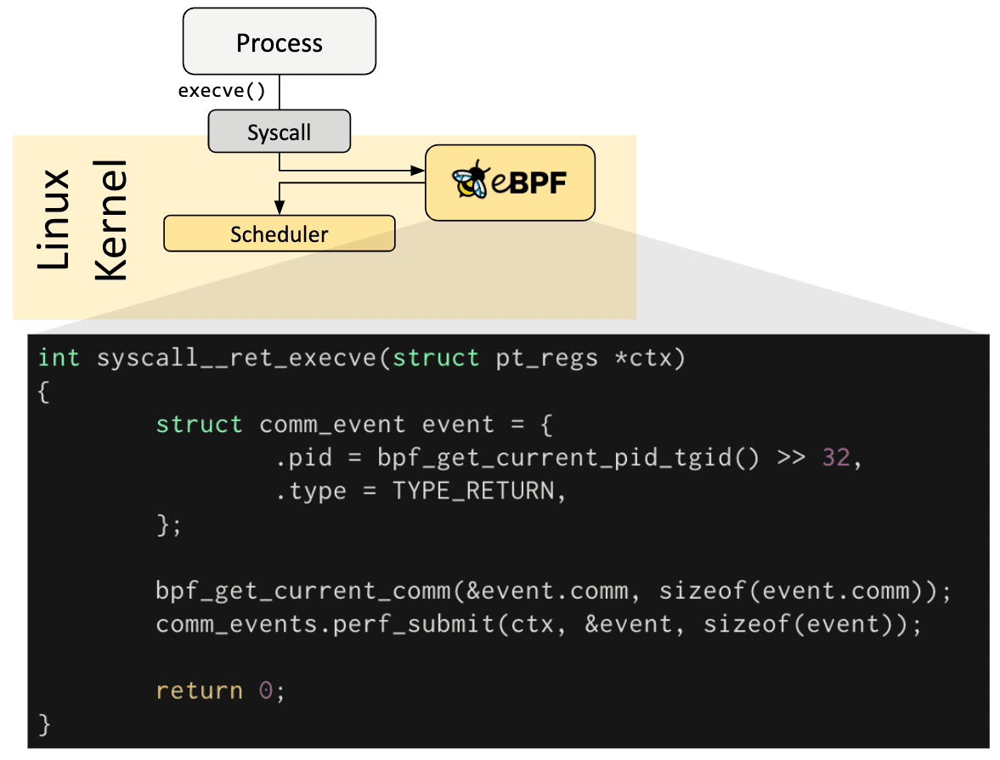
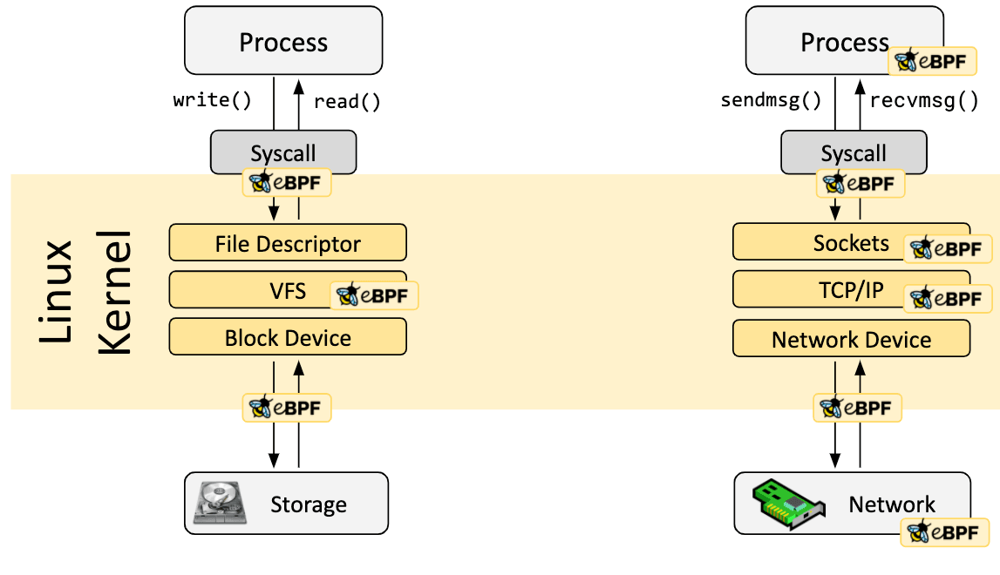
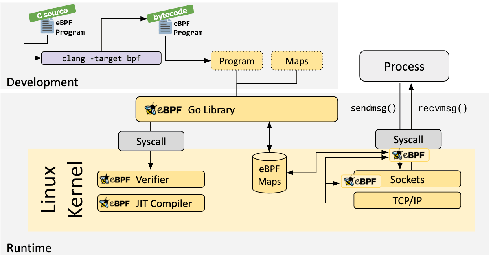
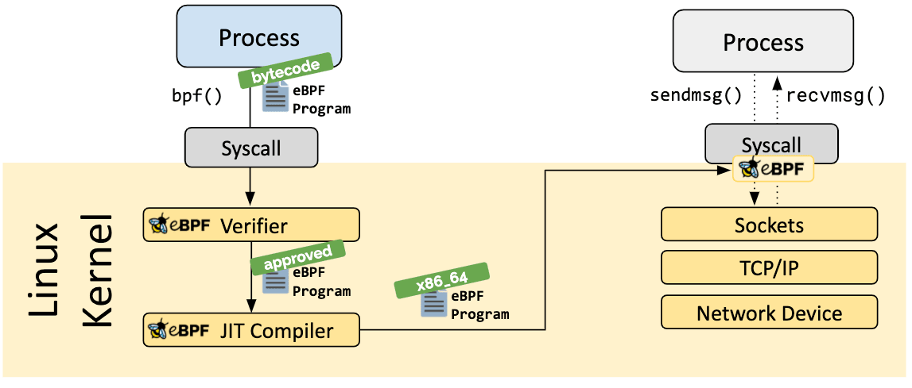
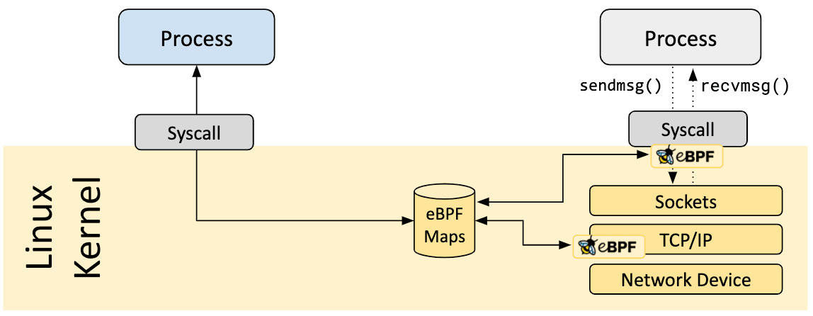

# TÌM HIỂU VỀ eBPF
# 1. eBPF là gì?
eBPF là một công nghệ có nguồn gốc từ Linux Kernel, có thể chạy các sanboxed programs trong các ngữ cảnh đặc quyền như nhân hệ điều hành. Nó được sử dụng để mở rộng khả năng của kernel một cách an toàn và hiệu quả mà không cần thay đổi mã nguồn của nhân hoặc tải các kernel modules.

Một số use cases eBPF được sử dụng:
- Cung cấp mạng hiệu suất cao và cân bằng tải trong các trung tâm dữ liệu hiện đại và môi trường cloud-native.
- Trích xuất dữ liệu quan sát bảo mật chi tiết với chi phí tài nguyên thấp.
- Hỗ trợ các nhà phát triển ứng dụng theo dõi/giám sát ứng dụng.
- Cung cấp thông tin cho việc xử lý liên quan đến sự cố về hiệu suất của một hệ thống hoặc ứng dụng.

BPF ban đầu là viết tắt của Berkeley Packet Filter, nhưng giờ đây vì eBPF (extended BPF) có thể làm được nhiều việc hơn là chỉ lọc gói tin, nên từ viết tắt này không còn hợp lý nữa. eBPF hiện nay được coi là một thuật ngữ độc lập và không còn đại diện cho bất kỳ cụm từ nào. Trong mã nguồn Linux, thuật ngữ BPF vẫn tồn tại, và trong công cụ cũng như tài liệu, các thuật ngữ BPF và eBPF thường được sử dụng thay thế cho nhau. BPF ban đầu đôi khi được gọi là cBPF (classic BPF) để phân biệt với eBPF.

# 2. Giới thiệu về eBPF
- **Tổng quan về hook:**

   Các chương trình eBPF là chương trình điều khiển sự kiện và được thực thi khi nhân hệ điều hành (kernel) hoặc một ứng dụng đi qua một điểm móc (hook point) nhất định. Các điểm móc đã được định nghĩa trước bao gồm system calls, điểm vào/ra của các hàm, các điểm theo dõi trong kernel (kernel tracepoints), các sự kiện mạng, và một số điểm khác.

    

    Nếu một điểm móc (hook point) đã được định nghĩa trước không có sẵn cho một nhu cầu cụ thể, có thể tạo một kernel probe (kprobe) hoặc user probe (uprobe) để gắn các chương trình eBPF vào gần như bất kỳ đâu trong kernel hoặc ứng dụng người dùng.

    

- **Chương trình eBPF được viết như nào:**

    Trong nhiều trường hợp, eBPF không được sử dụng trực tiếp mà gián tiếp thông qua các dự án như **Cilium, bcc hoặc bpftrace**, những dự án này cung cấp một lớp trừu tượng trên eBPF (an abstraction on top of eBPF) và không yêu cầu viết chương trình trực tiếp, mà thay vào đó cung cấp khả năng chỉ định các định nghĩa dựa trên mục đích, sau đó được triển khai bằng eBPF.

    Nếu không có lớp trừu tượng cấp cao hơn, các chương trình cần phải được viết trực tiếp. Kernel Linux yêu cầu các chương trình eBPF được tải dưới dạng bytecode. Mặc dù có thể viết bytecode trực tiếp, nhưng thực tế phát triển phổ biến hơn là sử dụng bộ biên dịch như **LLVM** để biên dịch mã giả C thành bytecode eBPF.

    

- **Loader and Verification Architecture:**

    

    Khi đã xác định được hook mong muốn, chương trình eBPF có thể được tải vào kernel Linux thông qua system call bpf. Thông thường, việc này được thực hiện thông qua một trong các thư viện eBPF có sẵn.

    - **Verification:**
    
    Bước xác minh đảm bảo rằng chương trình eBPF an toàn để chạy trên hệ thống. Quá trình này kiểm tra chương trình eBPF để đảm bảo nó đáp ứng một số điều kiện quan trọng nhằm tránh các vấn đề về bảo mật và ổn định hệ thống. Cụ thể, một số điều kiện cần kiểm tra là:

    
           
       - Quy trình tải chương trình eBPF phải có các quyền (capabilities) yêu cầu. Trừ khi unprivileged eBPF được bật (cho phép người dùng không có quyền root tải chương trình eBPF), chỉ các quy trình có quyền đặc biệt (privileged processes) mới có thể tải chương trình eBPF vào kernel.
       - Chương trình eBPF không được gây ra lỗi hoặc làm hệ thống gặp sự cố trong quá trình chạy.
       - Chương trình eBPF phải hoàn thành công việc của mình mà không bị treo hoặc chạy mãi mãi trong một vòng lặp vô hạn.

    - **JTL Compilation:** 
    
    Bước biên dịch Just-in-Time (JIT) chuyển đổi bytecode chung của chương trình eBPF thành các lệnh máy tính phù hợp với kiến trúc cụ thể của hệ thống, giúp tối ưu hóa tốc độ thực thi chương trình. Điều này giúp các chương trình eBPF chạy hiệu quả như mã kernel đã được biên dịch bản địa (natively compiled kernel code) hoặc mã đã được tải dưới dạng mô-đun kernel (code loaded as a kernel module).

    - **Map:**
    
    

    eBPF Maps đóng vai trò quan trọng trong việc chia sẻ và lưu trữ trạng thái dữ liệu giữa các chương trình eBPF và không gian người dùng (user space).

    Chia sẻ dữ liệu: Các chương trình eBPF có thể ghi và đọc dữ liệu từ maps, giúp chúng lưu trữ các thông tin về trạng thái hoặc các kết quả tính toán, sau đó chia sẻ cho các chương trình eBPF khác hoặc các ứng dụng ở không gian người dùng (user space).

    Một quy trình người dùng (Process) có thể sử dụng syscall để truy cập các eBPF maps. Điều này có nghĩa là không chỉ các chương trình eBPF trong kernel có thể tương tác với maps, mà các ứng dụng ở không gian người dùng cũng có thể đọc và ghi dữ liệu vào các maps này thông qua các gọi hệ thống (system calls).

    Một số loại map được hỗ trợ trong eBPF:

         - Bảng băm: Là một cấu trúc dữ liệu cho phép ánh xạ khóa (key) đến giá trị (value).
         - Mảng: Một cấu trúc dữ liệu đơn giản, chứa các phần tử theo chỉ số (index).
         - LRU (Least Recently Used) (Danh sách sử dụng ít nhất gần đây).
         - Ring Buffer (Bộ đệm vòng): Là một cấu trúc dữ liệu cho phép lưu trữ một lượng lớn dữ liệu theo kiểu vòng, nghĩa là khi bộ đệm đầy, dữ liệu mới sẽ ghi đè lên dữ liệu cũ.
         - Stack Trace (Truy vết ngăn xếp): Là một cấu trúc dữ liệu lưu trữ thông tin về các ngăn xếp (stack trace) trong quá trình thực thi chương trình.
         - LPM (Longest Prefix Match) (Khớp tiền tố dài nhất): Là một loại bảng giúp tìm kiếm địa chỉ IP hoặc các chuỗi khớp với tiền tố dài nhất, thường dùng trong các tình huống liên quan đến định tuyến hoặc phân phối dữ liệu.

