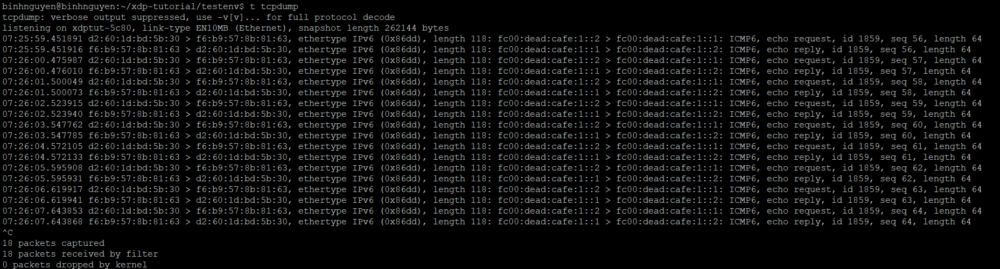

# PHÂN TÍCH GÓI TIN
# 1. Một số định nghĩa cần lưu ý
## 1.1 Con trỏ data và data_end
Khi một chương trình XDP được thực thi, nó sẽ nhận một con trỏ đến đối tượng `struct xdp_md`, đối tượng này chứa thông tin ngữ cảnh về gói tin. Cấu trúc này được định nghĩa trong tệp `bpf.h` như sau:

```
struct xdp_md {
	__u32 data;
	__u32 data_end;
	__u32 data_meta;
	/* Below access go through struct xdp_rxq_info */
	__u32 ingress_ifindex; /* rxq->dev->ifindex */
	__u32 rx_queue_index;  /* rxq->queue_index  */
};
```
- Hai trường cuối trong cấu trúc này chỉ là các trường dữ liệu chứa ifindex (chỉ số giao diện nhận gói tin) và chỉ số hàng đợi RX mà gói tin được nhận từ đó.
- Trường `data` trỏ đến đầu gói tin, trường `data_end` trỏ đến cuối gói tin, và trường `data_meta` trỏ đến khu vực metadata mà các chương trình XDP có thể sử dụng để lưu trữ siêu dữ liệu đi kèm gói tin.

Trình verifier (trình kiểm tra) sẽ viết lại các truy cập con trỏ khi chương trình được nạp vào để trỏ đúng đến dữ liệu gói tin thực tế. Nhưng để trình biên dịch chấp nhận kiểu dữ liệu đúng, ta cần ép kiểu các trường này sang con trỏ khi truy cập chúng. Vì vậy, các chương trình XDP thường bắt đầu với đoạn mã gán như sau:
```
	void *data_end = (void *)(long)ctx->data_end;
	void *data = (void *)(long)ctx->data;
```
## 1.2 Kiểm tra phạm vi gói tin
Mỗi chương trình xử lý gói tin có thể truy cập trực tiếp vào vùng nhớ chứa gói đó. Tuy nhiên, để tránh lỗi truy cập ngoài giới hạn verifier buộc chương trình phải chứng minh vùng nhớ muốn truy cập không vượt quá `data_end`.

Ví dụ:
```
if (data + 10 < data_end)
    /* thao tác với 10 byte đầu tiên của data */
else
    /* bỏ qua không truy cập gói tin */
```
## 1.3 Con trỏ header để theo dõi vị trí phân tích hiện tại
`Header cursor:` là một con trỏ (biến con trỏ) trỏ đến phần hiện tại của gói tin đang được phân tích — thường bắt đầu từ data và di chuyển dần qua các lớp header (Ethernet → IP → TCP/UDP...).
```
/* Header cursor to keep track of current parsing position */
struct hdr_cursor {
	void *pos;
};
```
## 1.4 Mã trả về của chương trình
Kết quả cuối cùng cho việc xử lý gói tin sẽ như thế nào sau khi được xử lý bởi chương trình XDP sẽ được thông báo cho kernel thông qua mã trả về `(return code)`. Các mã này được định nghĩa trong tệp bpf.h như sau:
```
enum xdp_action {
	XDP_ABORTED = 0,
	XDP_DROP,
	XDP_PASS,
	XDP_TX,
	XDP_REDIRECT,
};
```
- `XDP_PASS`: Cho phép gói tin đi lên ngăn xếp mạng Linux như bình thường.
- `XDP_DROP`: Hủy bỏ gói tin, không để nó đi tiếp.
- `XDP_ABORTED`: Hủy bỏ và ghi log cho debug (với tracepoint xdp:xdp_exception).
- `XDP_TX`: Gửi trả lại gói tin ra interface nơi nó đi vào.
- `XDP_REDIRECT`: Chuyển tiếp gói sang interface khác.

## 1.5 Định nghĩa header của gói tin và thứ tự byte
- Định nghĩa header của gói tin: Là các cấu trúc (struct) đại diện cho các header giao thức trong gói tin. 
 
  Vì một chương trình XDP chỉ nhận được một con trỏ trỏ tới bộ đệm dữ liệu thô (raw data buffer), nên nó cần tự phân tích các header của gói tin. Để hỗ trợ việc này, kernel đã định nghĩa sẵn các cấu trúc (struct) chứa các trường của header gói tin.

  - `struct ethhdr `   <--->   	`<linux/if_ether.h>`
  - `struct ipv6hdr`   <--->    `<linux/ipv6.h>`
  - `struct iphdr`	   <--->    `<linux/ip.h>`
  - `struct icmp6hdr`  <--->    `<linux/icmpv6.h>`
  - `struct icmphdr`   <--->    `<linux/icmp.h>`

- Thứ tự byte: Đề cập đến việc số nguyên nhiều byte (như 16-bit, 32-bit) được lưu theo thứ tự nào trong bộ nhớ.
   
   Có 2 kiểu:
   - Big-endian: byte cao lưu trước.
   - Little-endian: byte thấp lưu trước.

# 2. Bài tập
## 2.1 Bài tập 1: Khắc phục lỗi kiểm tra phạm vi truy cập bộ nhớ
Trong eBPF/XDP, khi  tích gói tin (packet parsing), mọi truy cập vào vùng nhớ gói phải được kiểm tra kỹ càng để không vượt quá data_end. Nếu không, verifier của kernel sẽ từ chối chương trình vì lý do an toàn bộ nhớ.

Lỗi gặp phải là đoạn code trong hàm `parse_ethhdr()`đang chứa lỗi kiểm tra giới hạn (bounds checking).


Lỗi nằm ở dòng sau:
```
if (nh->pos + 1 > data_end)
```
nh->pos + 1 chỉ tăng địa chỉ thêm 1 byte, trong khi header Ethernet có kích thước lớn hơn nhiều (thường là 14 bytes).

Sửa lỗi như sau:
```
if ((void *)nh->pos + hdrsize > data_end)
```
Tải lại chương trình vào interface và kiểm tra status:


## 2.2 Bài tập 2: Phân tích header IP
Giờ khi chương trình phân tích header Ethernet đã hoạt động, chúng ta sẽ thêm bước phân tích header IP. Để làm điều này, cài đặt hàm `parse_ip6hdr()`:

```
static __always_inline int parse_ip6hdr(struct hdr_cursor *nh,
                                        void *data_end,
                                        struct ipv6hdr **ip6hdr)
{
    struct ipv6hdr *ip6h = nh->pos;

    // Kiểm tra giới hạn: đảm bảo không đọc ngoài vùng data_end
    if (ip6h + 1 > data_end)
        return -1;

    // Cập nhật con trỏ vị trí hiện tại
    nh->pos = ip6h + 1;

    // Trả về con trỏ tới header cho người gọi sử dụng
    *ip6hdr = ip6h;

    // Trả về mã giao thức lớp tiếp theo (ICMPv6, TCP, UDP...)
    return ip6h->nexthdr;
}
```

Thêm đoạn gọi `parse_ip6hdr()` vào `SEC("xdp)`:
```
struct ipv6hdr *ip6h;
nh_type = parse_ip6hdr(&nh, data_end, &ip6h);
if (nh_type < 0)
    goto out;
```
Gõ lệnh `make` và load file `xdp_prog_kern.o` vào interface ns được tạo:
```
sudo ~/xdp-tutorial/packet01-parsing/xdp_loader load xdptut-5c80 xdp_prog_kern.o
```
Gõ lệnh dưới để kiểm tra file XDP đã được gắn vào interface chưa:
```
sudo ~/xdp-tutorial/packet01-parsing/xdp_loader status
```


Gõ lệnh `t ping` và `t tcpdump` để check gói tin:



## 2.3 Phân tích header ICMPv6 và xử lý tùy theo nội dung
Cài đặt logic như sau:
- Trả về `XDP_DROP` nếu sequence number là chẵn.

- Trả về `XDP_PASS` nếu sequence là lẻ.

Mở file `xdp_prog_kern.c` viết hàm `parse_icmp6hdr()`:
```
static __always_inline int parse_icmp6hdr(struct hdr_cursor *nh, void *data_end,
                                          struct icmp6hdr **icmp6hdr)
{
    struct icmp6hdr *icmp6h = nh->pos;
    if (icmp6h + 1 > data_end)
        return -1;

    nh->pos = icmp6h + 1;
    *icmp6hdr = icmp6h;
    return icmp6h->icmp6_type;
}
```

Gọi nó trong `xdp_parser_func()`:
```
struct icmp6hdr *icmp6h;
nh_type = parse_icmp6hdr(&nh, data_end, &icmp6h);
if (nh_type < 0)
    goto out;
```

Thêm logic DROP nếu sequence là chẵn:
```
if (bpf_ntohs(icmp6h->icmp6_sequence) % 2 == 0) {
    action = XDP_DROP;
}
```

Biên dịch và chạy:

```
make
t load
t ping
```


## 2.4 Thêm hỗ trợ VLAN
Mở rộng hàm `parse_ethhdr()` để nhận diện và phân tích VLAN tag.

Nếu có VLAN tag, ta đơn giản đọc tiếp ethertype bên trong, và di chuyển con trỏ parser vượt qua VLAN tag để đến header tiếp theo.

Vì header VLAN không được export trong các file tiêu chuẩn của kernel, ta cần tự định nghĩa như sau:
```
struct vlan_hdr {
  __be16 h_vlan_TCI;
  __be16 h_vlan_encapsulated_proto;
};
```
Để kiểm tra một gói có phải VLAN hay không, ethertype phải là:
- `ETH_P_8021Q` hoặc
- `ETH_P_8021AD` (cả hai đều định nghĩa trong if_ether.h)

Dùng hàm tiện ích sau để kiểm tra một gói có phải VLAN hay không:
```
static __always_inline int proto_is_vlan(__u16 h_proto)
{
  return !!(h_proto == bpf_htons(ETH_P_8021Q) ||
            h_proto == bpf_htons(ETH_P_8021AD));
}
```

Thêm định nghĩa `struct vlan_hdr`:
```
struct vlan_hdr {
    __be16 h_vlan_TCI;
    __be16 h_vlan_encapsulated_proto;
};
```

Thêm định nghĩa của hàm `proto_is_vlan()`:
```
static __always_inline int proto_is_vlan(__u16 h_proto)
{
    return !!(h_proto == bpf_htons(ETH_P_8021Q) ||
              h_proto == bpf_htons(ETH_P_8021AD));
}
```

 Cập nhật phần mở rộng VLAN trong hàm `parse_ethhdr()`:
 ```
 __be16 eth_type = eth->h_proto;

while (proto_is_vlan(eth_type)) {
    struct vlan_hdr *vhdr = (struct vlan_hdr *)(nh->pos);

    if ((void *)(vhdr + 1) > data_end)
        return -1;

    eth_type = vhdr->h_vlan_encapsulated_proto;
    nh->pos = (void *)(vhdr + 1);
}

return eth_type;
 ```

 Gõ lệnh `t reset --vlan` để khởi tạo lại môi trường test với hỗ trợ VLAN.

 Gán file `xdp_prog_kern.o` vào interface VLAN vừa tạo với lệnh:
 ```
 sudo ~/xdp-tutorial/packet01-parsing/xdp_loader load xdptut-5c80.1 xdp_prog_kern.o --mode SKB
 ```

 Gõ lệnh `t ping --vlan` để gửi ping6 giữa các interface có VLAN tag để test chương trình XDP.

 

 ## 2.5 Thêm hỗ trợ IPv4
 