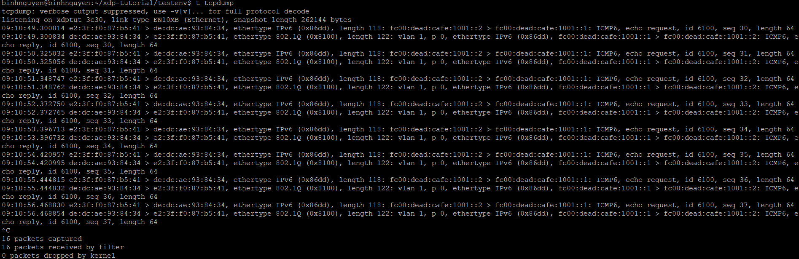
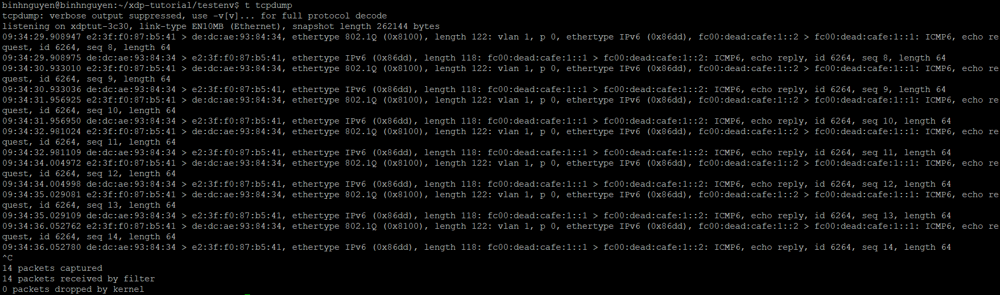

# SỬA ĐỔI GÓI TIN
# 1. Một số định nghĩa cần lưu ý
## 1.1 Ghi đè dữ liệu gói tin bằng cách truy cập trực tiếp bộ nhớ
Trong eBPF/XDP, khi bạn viết chương trình để xử lý gói tin, bạn được cung cấp con trỏ tới vùng nhớ chứa gói tin. Bạn có thể truy cập trực tiếp vào vùng nhớ này để đọc và ghi dữ liệu.

Tuy nhiên, để đảm bảo an toàn bộ nhớ trong kernel, verifier sẽ kiểm tra:
- Không truy cập ra ngoài phạm vi `data` đến `data_end`.
- Chỉ đọc/ghi trong vùng cho phép.

## 1.2 Mở rộng và thu nhỏ kích thước gói tin
Kernel cung cấp một hàm trợ giúp eBPF để thực hiện việc bọc gói (encapsulation) hoặc gỡ bỏ header của giao thức khỏi một gói tin, gọi là `bpf_xdp_adjust_head()`.

Hàm này nhận vào đối tượng ngữ cảnh XDP và một giá trị điều chỉnh kích thước làm tham số. Nó sẽ dịch con trỏ đầu gói đi một số byte tương ứng:
- Một số dương sẽ thu nhỏ kích thước gói tin (bỏ bớt phần đầu).
- Một số âm sẽ mở rộng gói tin (thêm dữ liệu vào đầu gói).

Có một vài điều cần lưu ý khi dùng hàm trợ giúp này:
1. Việc điều chỉnh có thể thất bại nếu:

   - Kích thước mới khiến gói tin không đủ nhỏ để chứa ít nhất header Ethernet, hoặc
   - Không còn đủ vùng nhớ trước đầu gói để thêm dữ liệu (vì gói tin thường nằm ở offset cố định trong bộ nhớ).

2. Hàm này chỉ điều chỉnh con trỏ data, chứ không tự sửa lại nội dung gói tin. Tức là lập trình viên XDP phải tự đảm bảo gói tin vẫn hợp lệ sau khi điều chỉnh — ví dụ như ghi lại header Ethernet mới, và cập nhật các trường header sau đó cho phù hợp.
3. Trình verifier (kiểm tra an toàn) sẽ xóa toàn bộ thông tin kiểm tra giới hạn trước đó sau khi kích thước gói bị thay đổi. Nghĩa là chương trình XDP cần thực hiện lại các kiểm tra data và data_end để đảm bảo an toàn sau khi điều chỉnh.

# 2. Bài tập
## 2.1 Sửa đổi port number
Truy cập vào header UDP hoặc TCP, lấy trường dest (cổng đích), giảm đi 1 đơn vị, và ghi lại vào chính trường đó.


## 2.2 Gỡ bỏ thẻ VLAN ngoài cùng
Chương trình XDP sẽ khiến cho không thấy bất kỳ thẻ VLAN nào trong các gói tin ping yêu cầu (echo request), tuy nhiên, các gói phản hồi (echo reply) vẫn sẽ có thẻ VLAN.

Mở file `xdp_prog_kern.c` tiến hành thêm đoạn code ở phần:
```
static __always_inline
int vlan_tag_pop(struct xdp_md *ctx, void *data, void *data_end, struct ethhdr *eth)
{
}
```

Thêm đoạn code sau:
```
void *data_end = (void *)(long)ctx->data_end;
void *data = (void *)(long)ctx->data;

struct ethhdr eth_cpy;
struct vlan_hdr *vlh;
__be16 h_proto;

int vlen = sizeof(struct vlan_hdr);
int vlin = -1;

if ((void *)eth + sizeof(struct ethhdr) + vlen > data_end)
   return -1;

vlh = (void *)eth + sizeof(struct ethhdr);


vlin = bpf_ntohs(vlh->h_vlan_TCI) & 0x0fff;
h_proto = vlh->h_vlan_encapsulated_proto;
  
__builtin_memcpy(&eth_cpy, eth, sizeof(struct ethhdr));

if (bpf_xdp_adjust_head(ctx, vlen) < 0);
return -1;

data = (void *)(long)ctx->data;
data_end = (void *)(long)ctx->data_end;

eth = data;
if ((void *)eth + sizeof(struct ethhdr) > data_end)
return -1;

__builtin_memcpy(eth, &eth_cpy, sizeof(struct ethhdr));eth->h_proto = h_proto;

return vlin; 
```

Sau đó chạy lệnh `make` và gắn chương trình XDP vào interface trong môi trường test. Gõ lệnh `t tcpdump` để theo dõi:



Có thể thấy, gói tin `echo request` đã không còn hiện vlan id tuy nhiên gói tin `echo reply` vẫn còn xuất hiện vlan id.

## 2.3 Khôi phục lại thẻ VLAN đã bị loại bỏ
Thêm VLAN tag vào gói nếu nó chưa có, bằng cách dùng `vlan_tag_push()`.

Mở file `xdp_prog_kern.c` tiến hành thêm đoạn code ở phần:
```
static __always_inline
int vlan_tag_push(struct xdp_md *ctx, struct ethhdr *eth, int vlid)
{
}
```

Thêm đoạn code sau:
```
void *data = (void *)(long)ctx->data;
void *data_end = (void *)(long)ctx->data_end;

int vlan_size = sizeof(struct vlan_hdr);
struct ethhdr eth_cpy;
struct vlan_hdr *vh;

__builtin_memcpy(&eth_cpy, eth, sizeof(struct ethhdr));

if (bpf_xdp_adjust_head(ctx, 0 - vlan_size) < 0)
   return -1;

data = (void *)(long)ctx->data;
data_end = (void *)(long)ctx->data_end;

eth = data;
if ((void *)(eth + 1) + vlan_size > data_end)
   return -1;

__builtin_memcpy(eth, &eth_cpy, sizeof(struct ethhdr));

vh = (void *)eth + sizeof(struct ethhdr);
if ((void *)(vh + 1) > data_end)
   return -1;

vh->h_vlan_TCI = bpf_htons(vlid);          
vh->h_vlan_encapsulated_proto = eth_cpy.h_proto; 

eth->h_proto = bpf_htons(ETH_P_8021Q); // 0x8100

    return 0;
```
Sau đó chạy lệnh `make` và gắn chương trình XDP vào interface trong môi trường test. Gõ lệnh `t tcpdump` để theo dõi:



Có thể thấy, gói tin `echo request` đã xuấ hiện lại vlan id trong khi gói tin `echo reply` sẽ xuất hiện lại vlan id do cùng chạy đồng thời hai hàm `vlan_tag_pop()` và `vlan_tag_push()`.