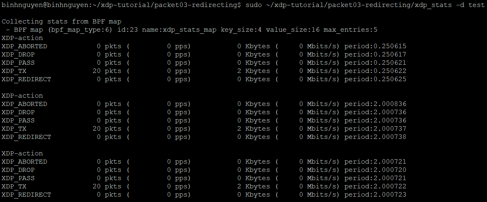
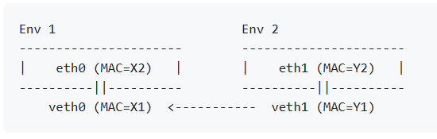
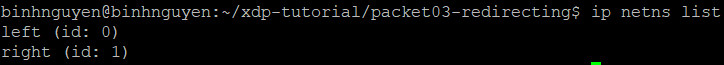
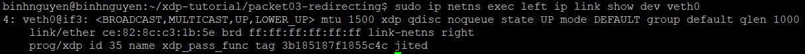
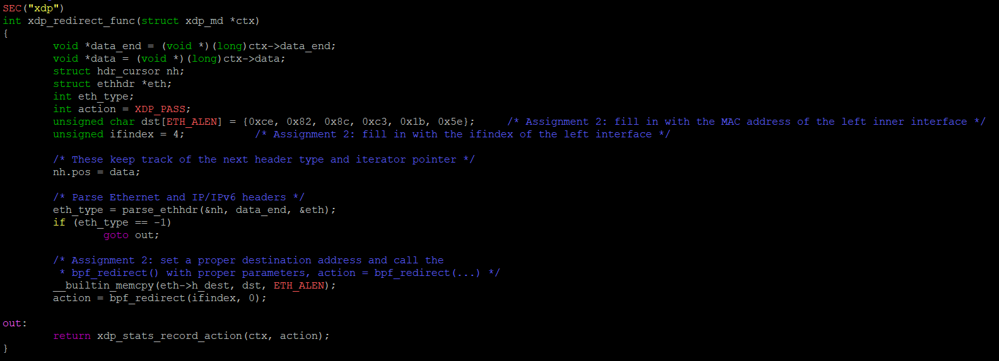
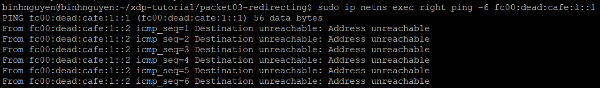
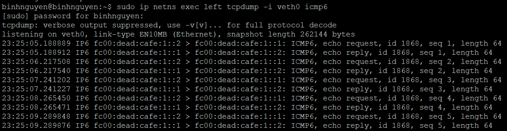

# CHUYỂN HƯỚNG GÓI TIN
# 1. Một số định nghĩa cần lưu ý
## 1.1 Gửi gói tin trở lại chính giao diện mà nó đến
Giá trị trả về `XDP_TX` có thể được sử dụng để gửi gói tin trở lại cùng giao diện mà nó đã đến. Chức năng này có thể được dùng để triển khai bộ cân bằng tải (load balancer), gửi phản hồi ICMP đơn giản.
## 1.2 Chuyển hướng gói tin sang các giao diện (interface) khác
Mục đích của chuyển hướng gói tin (packet redirection):
- Xây dựng load balancer: Chuyển gói tin đến server thích hợp dựa vào hash/IP/port.
- Thiết kế router cấp thấp: Xử lý định tuyến tại tầng driver.
- Tăng hiệu suất mạng: Vì xử lý ngay tại điểm vào của card mạng, không cần đi qua nhân Linux.
- Triển khai các giải pháp DDOS mitigation, NAT, v.v.

Để chuyển tiếp gói tin đến các cổng ra (egress ports) của các giao diện khác có thể thực hiện bằng cách sử dụng các hàm hỗ trợ `bpf_redirect` hoặc `bpf_redirect_map`.

Sử dụng `bpf_redirect`:
- Nhận ifindex (chỉ số của interface đích).
- Trả về XDP_REDIRECT.

Sử dụng `bpf_redirect_map`:
- Phức tạp hơn, dùng map kiểu `BPF_MAP_TYPE_DEVMAP` để ánh xạ các ID đến interface thực.
## 1.3 Xây dựng một bộ định tuyến (router) sử dụng hàm hỗ trợ của kernel
Trong XDP/eBPF, kernel helper là các hàm do kernel cung cấp cho chương trình eBPF để thực hiện các thao tác phức tạp hơn, như tra cứu bảng định tuyến, xử lý checksum, lấy thông tin interface, v.v.

Có thể viết một chương trình eBPF hoạt động như một router ở tầng rất thấp (trước cả khi kernel xử lý gói tin), bằng cách:
- Nhận gói tin đến tại một interface (ví dụ eth0).
- Dùng kernel helper như `bpf_fib_lookup()` để:
    - Tra xem gói tin đó cần được gửi đi đâu dựa vào bảng định tuyến của kernel.
    - Tìm ra interface đích và địa chỉ MAC cần gửi đến.
- Dùng `bpf_redirect()` hoặc `bpf_redirect_map()` để chuyển hướng gói tin tới interface phù hợp.

## 2. Bài tập
## 2.1 Bài tập 1: Gửi gói tin trở lại chính giao diện mà nó đến
- Thiết lập môi trường test (dùng veth pair):
```
t setup -n test --legacy-ip
```
- Nạp chương trình XDP cho từng phía của cặp veth:
```
t exec -n test -- ./xdp-loader load --prog-name xdp_pass_func veth0 xdp_prog_kern.o
```

```
t load -n test --prog-name xdp_icmp_echo_func xdp_prog_kern.o
```
- Thực hiện ping để kiểm tra chương trình hoạt động:
```
t ping
# hoặc kiểm tra IPv4:
t ping --legacy-ip
```
- Xem thống kê bằng `xdp_stats` để xác nhận chương trình phản hồi bằng `XDP_TX`:
```
$ sudo ./xdp_stats -d test
```


## 2.2 Bài tập 2: Chuyển hướng gói tin giữa 2 cổng mạng
- Gói tin gửi từ interface eth1 (phía right) sẽ đến veth1, sau đó được chuyển hướng sang veth0 bên phía left nhờ XDP.
- Sau khi chuyển hướng, gói tin xuất hiện tại eth0 (phía left).



Các lệnh để tạo 2 môi trường left và right:
- Bước 1: Tạo namespace
```
sudo ip netns add left
sudo ip netns add right
```
- Bước 2: Tạo cặp veth kết nối
```
sudo ip link add veth0 type veth peer name veth1
```
- Bước 3: Gán veth vào namespace
```
sudo ip link set veth0 netns left
sudo ip link set veth1 netns right
```
- Bước 4: Cấu hình địa chỉ IP
```
# Trong namespace left
sudo ip netns exec left ip addr add fc00:dead:cafe:1::1/64 dev veth0
sudo ip netns exec left ip link set dev veth0 up
sudo ip netns exec left ip link set dev lo up

# Trong namespace right
sudo ip netns exec right ip addr add fc00:dead:cafe:1::2/64 dev veth1
sudo ip netns exec right ip link set dev veth1 up
sudo ip netns exec right ip link set dev lo up
```
- Bước 5: Kiểm tra lại bằng lệnh `ip netns list`


Các bước thực hiện:
- Bước 1: Load chương trình dummy vào veth0 bên left
```
sudo ip netns exec left ./xdp-loader load --prog-name xdp_pass_func veth0 xdp_prog_kern.o
```
- Bước 2: Chỉnh sửa hàm `xdp_redirect_func` trong file `xdp_prog_kern.c`:

    - Kiểm tra địa chỉ MAC và ifindex của veth0:
     
    - Tiến hành thêm địa chỉ MAC và ifindex của veth0 vào hàm `xdp_redirect_func`:
    

- Bước 3: Load chương trình xdp_redirect_func vào veth1 bên right
```
sudo ip netns exec right ./xdp-loader load --prog-name xdp_redirect_func veth1 xdp_prog_kern.o
```
- Bước 4: Gửi ping từ right sang left
```
sudo ip netns exec right ping fc00:dead:cafe:1::1
```

- Bước 5: Quan sát gói tin bằng tcpdump bên left
```
sudo ip netns exec left tcpdump -i veth0
```


- Bước 6: Có thể thấy gói tin đã được redirect qua bên left tuy nhiên do chưa cấu hình route nên ping từ right qua left vẫn chưa nhận được phản hồi dẫn đến `Destination unreachable`.

