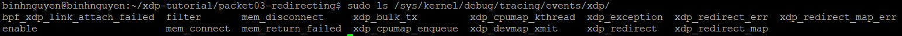

# THEO DÕI TRACEPOINT CỦA XDP
# 1. Một số định nghĩa cần lưu ý
## 1.1 XDP Tracepoint
Các chương trình eBPF cũng có thể được gắn vào các tracepoint. Có một số tracepoint liên quan đến hệ thống tracepoint của XDP:
```
ls /sys/kernel/debug/tracing/events/xdp/
xdp_cpumap_enqueue  
xdp_cpumap_kthread  
xdp_devmap_xmit  
xdp_exception  
xdp_redirect  
xdp_redirect_err  
xdp_redirect_map  
xdp_redirect_map_err  
```

### 1.1.1 Phần chương trình tracepoint
Khi bạn viết một chương trình eBPF để gắn vào tracepoint, tên section phải tuân theo định dạng `tracepoint/<subsystem>/<event>`. Trong đó:
- `<sys>` là tên hệ thống tracepoint (subsystem), ví dụ như `xdp`.
- `<tracepoint>` là tên cụ thể của tracepoint, ví dụ như `xdp_exception`.

Ví dụ bạn muốn debug các lỗi xảy ra trong XDP thì có thể viết một chương trình eBPF như sau:
```
SEC("tracepoint/xdp/xdp_exception")
int trace_xdp_exception(struct xdp_exception_ctx *ctx) {
    // Ghi log, đếm số lỗi, in ra giao diện lỗi, v.v.
    return 0;
}
```
### 1.1.2 Tham số tracepoint
Có một đối số con trỏ chương trình duy nhất, chỉ vào cấu trúc, cấu hình các trường tracepoint.
Ví dụ, đối với tracepoint `xdp:xdp_exception`:
```
struct xdp_exception_ctx {
    __u64 __pad;        // 8 byte đầu tiên không thể truy cập bởi mã bpf
    __s32 prog_id;      // offset:8, size:4, signed:1;
    __u32 act;          // offset:12, size:4, signed:0;
    __s32 ifindex;      // offset:16, size:4, signed:1;
};
int trace_xdp_exception(struct xdp_exception_ctx *ctx)
```
Cấu trúc này được xuất khẩu trong tệp định dạng tracepoint:
```
# cat /sys/kernel/debug/tracing/events/xdp/xdp_exception/format
...
field:unsigned short common_type;   offset:0; size:2; signed:0;
field:unsigned char common_flags;   offset:2; size:1; signed:0;
field:unsigned char common_preempt_count; offset:3; size:1; signed:0;
field:int common_pid;                offset:4; size:4; signed:1;
field:int prog_id;                   offset:8; size:4; signed:1;
field:u32 act;                       offset:12; size:4; signed:0;
field:int ifindex;                   offset:16; size:4; signed:1;
...
```
### 1.1.3 Gắn chương trình vào tracepoint
Khi viết một chương trình eBPF để theo dõi tracepoint, sử dụng các hàm tiện ích từ thư viện bpf như sau:
- Bước 1: Mở file chương trình eBPF
```
bpf_object__open_file(cfg->filename, NULL);
```
- Bước 2: Load chương trình vào kernel
```
bpf_object__load(obj);
```
- Bước 3: Gắn chương trình vào tracepoint
```
bpf_program__attach_tracepoint(prog, "xdp", "xdp_exception");
```
## 1.2 HASH map
# 2. Bài tập
## 2.1 Bài tập 1: Thiết lập môi trường
- Khởi tạo môi trường test bằng câu lệnh:
```
sudo ~/xdp-tutorial/testenv/testenv.sh setup --name veth-basic02
```
- Tải chương trình `xdp_abort_func` vào thiết bị veth-basic02:

```
sudo ~/xdp-tutorial/basic02-prog-by-name/xdp_loader --dev veth-basic02 --progname xdp_abort_func
```
- Gửi gói tin để test chương trình:
```
sudo ../testenv/testenv.sh enter --name veth-basic02
ping fc00:dead:cafe:1::1
```

## 2.2 Bài tập 2: Tải chương trình tracepoint monitor
- Chạy app trace_load_and_stats, nó sẽ load và gắn chương trình eBPF vào tracepoint, đồng thời hiển thị số lượng gói tin bị hủy (aborted) trên mỗi giao diện mạng.
