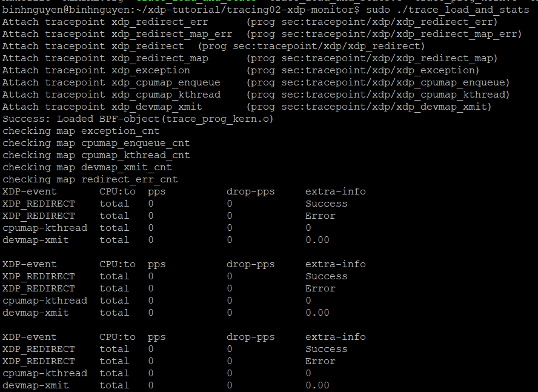
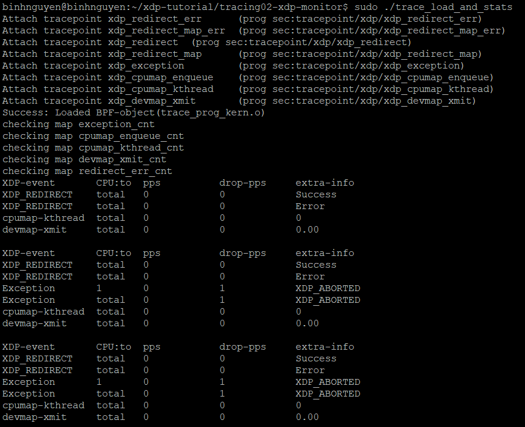
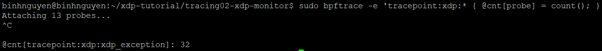

# 1. Tracepoint
# 2. Monitor
- Vào đường dẫn `~/xdp-tutorial/tracing02-xdp-monitor/` gõ lệnh:
```
sudo ./trace_load_and_stats
```


- Vào môi trường test `veth-basic02` gõ lệnh ping để kiểm thử:


# 3. Một số phương pháp monitor khác
## 3.1 bpftrace
bpftool trace là một công cụ dễ sử dụng để viết một dòng lệnh đơn giản (oneliner) có thể:
- Gắn vào tracepoint.
- Ghi nhận số lượng sự kiện đã xảy ra tại các tracepoint XDP.

Ví dụ, để gắn vào tất cả tracepoint thuộc subsystem xdp, ta có thể dùng:
```
sudo bpftrace -e 'tracepoint:xdp:* { @cnt[probe] = count(); }'
```
Kết quả:


## 3.2 perf record
Có thể dùng lệnh:
```
sudo perf record -e 'xdp:xdp_redirect' -a
```
- -e: chọn sự kiện muốn theo dõi (ở đây là tracepoint xdp:xdp_redirect)
- -a: ghi trên tất cả CPU