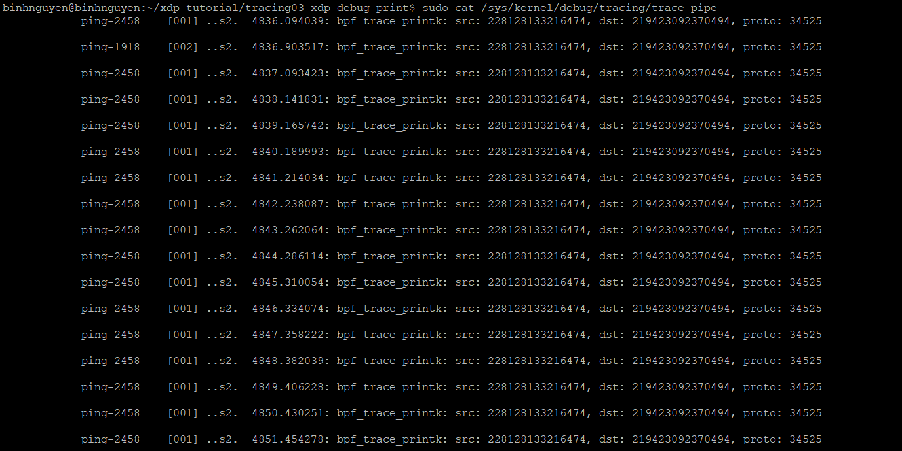
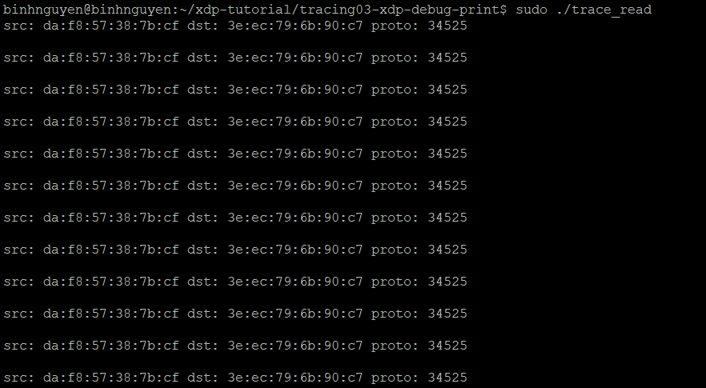

# IN THÔNG TIN ĐỂ DEBUG
# 1. eBPF trace printk helper
In thông tin từ chương trình eBPF ra log, sử dụng một helper function đặc biệt:
```
int bpf_trace_printk(const char *fmt, __u32 fmt_size, ...);
```
Hoặc:
```
bpf_printk("msg: value=%d\n", some_var);
```
Cách xem log được in từ helper này:
```
sudo cat /sys/kernel/debug/tracing/trace_pipe
```
Ví dụ thực tế trong XDP/eBPF:
```
SEC("xdp")
int xdp_prog(struct xdp_md *ctx)
{
    int ifindex = ctx->ingress_ifindex;
    bpf_printk("XDP prog triggered on ifindex=%d\n", ifindex);
    return XDP_PASS;
}
```
XDP prog triggered on ifindex=5
# 2. The tracefs pipe reader
Trace pipe là một file đặc biệt trong hệ thống Linux. Chứa các log realtime được in ra từ các chương trình eBPF sử dụng `bpf_trace_printk()` hoặc `bpf_printk()`.

Khi chương trình eBPF gọi `bpf_printk("abc %d", val);`, nội dung sẽ được ghi vào `/sys/kernel/debug/tracing/trace_pipe`.

# 3. Bài tập
- Gắn chương trình eBPF vào interface veth-basic02:
```
sudo xdp-loader load veth-basic02 xdp_prog_kern.o -s xdp
```
- Gửi gói tin để kiểm tra:
```
sudo ../testenv/testenv.sh enter --name veth-basic02
ping fc00:dead:cafe:1::1
```
- Xem log debug:
```
sudo cat /sys/kernel/debug/tracing/trace_pipe
```


```
sudo ./trace_read
```
