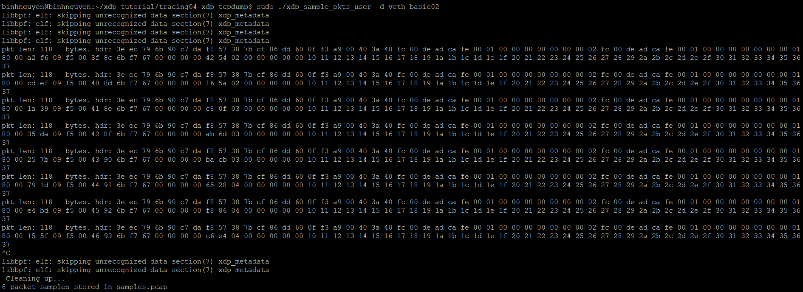
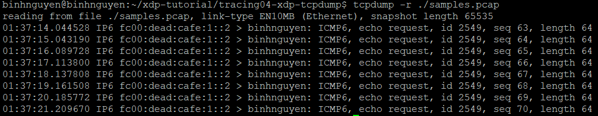

# 1. Trích xuất mẫu gói tin
Trong chương trình eBPF XDP:
- Dùng helper `bpf_perf_event_output()` hoặc `bpf_ringbuf_output()` để gửi gói tin từ kernel lên user-space.

Trong userspace:
- Nhận dữ liệu từ perf buffer hoặc ring buffer.
- Ghi vào file .pcap dùng thư viện libpcap.
# 2. Bài tập
- Gửi gói tin để kiểm tra:
```
sudo ../testenv/testenv.sh enter --name veth-basic02
ping fc00:dead:cafe:1::1
```
- Chạy chương trình để thu thập gói tin từ XDP:
```
sudo ./xdp_sample_pkts_user -d veth-basic02 
```

- Xem nội dung file .pcap:
```
tcpdump -r ./samples.pcap
```
